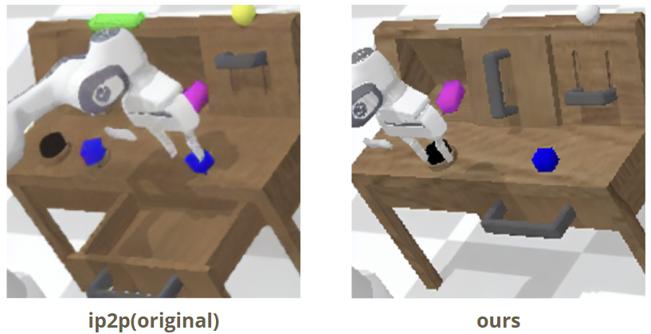
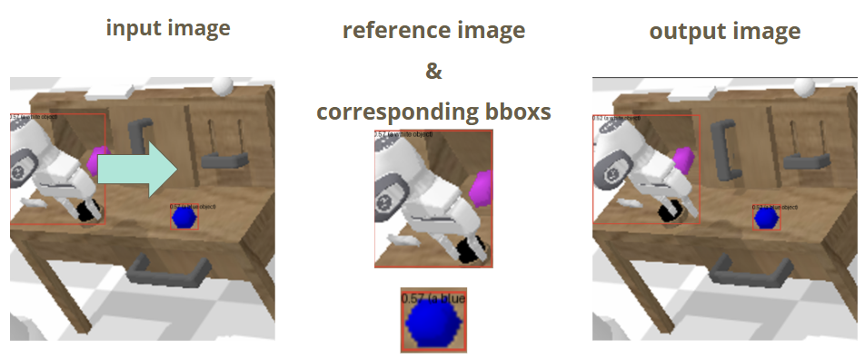

<h1>Fix what GR-MG can't do</h1>

## Introduction
GR-MG is a state-of-the-art robotics imitation learning model that has demonstrated exceptional performance on the CALVIN benchmark. However, we identified a performance discrepancy in specific tasks, particularly in "pushing objects to right". 

To address this limitation, we propose two enhancements to the original model pipeline:
1. Image Inpainting
<p align="center">
  
  <br>
  <em>Figure 1: Comparison between original method (left) and ours (right)</em>
</p>

<p align="center">
  
  <br>
  <em>Figure 2: Example of Image Inpainting applied to generate goal-image with robot arm move toward blue block</em>
</p>
2. Text Prompt Modification

### Enhancements to Text Prompt Engineering

- **Original Agent Design**:
  - Introduced a new token `[progress]` to provide percentage-based work process information for the goal image generation model.
  - Progress token helps track task completion but may lack clarity for specific situations.

- **Proposed Modifications**:
  - Add relative position information between objects and the robot arm using the BLIP model.
  - Example prompts:
    - "Is white arm on the left of blue object?"
    - "The arm is on the [direction] of the blue block."
    - "Is white object on the blue object?"
    - "Yes/No."

- **Benefits of Modified Prompts**:
  - Provides precise spatial information for generating accurate goal images.
  - Improves task performance by leveraging relative position data.

- **Progress Threshold Adjustment**:
  - When progress exceeds 40%, the robot arm is close to grabbing the object.
  - At this stage, additional prompts are unnecessary for goal image generation.
  - This adjustment enhances performance compared to the original model design.

#### Example of prompt and vqa 
  ``` bash
  Question: Is white arm on the left of pink object?
  Answer: yes

  Question: Is white object on the pink object?
  Answer: no

  Prompt: ['white arm on the left of pink object', 'white object not on the pink object']
  VQA_Prompt: ['white arm on the left of pink object', 'white object not on the pink object']
  Instruction: go push the pink block right. And 20% of the instruction has been finished. white arm on the left of pink object. white object not on the pink object.
  ```

Our experimental results show that these modifications yield modest improvements in tasks that previously showed suboptimal performance. Table 1. shows that only add prompt when progress in smaller than 0.4 has a good performance while Table 2. shows that adding position text prompt will aid the success rate of push object right

## Related Field

#### Visual Question Answering (VQA)
- utilize pretrained-vqa model to capture image information by BLIP2

#### Language Model
- Proficiency in leveraging advanced language models for text generation, understanding, and prompt engineering.

#### Image Inpainting
- Grounding-DINO and GLIGEN

## Task Performance with Progress-Based Prompts

#### Table 1: Performance Comparison Based on Progress Levels
| Task                   | Prompt with Full Progress | Prompt with Progress Under 40% |
|------------------------|---------------------------|---------------------------------|
| Push pink block right  | 51.7%                     | 69.6%                           |
| Push blue block right  | 47.8%                     | 65.5%                           |
| Push red block right   | 41.4%                     | 65.5%                           |

#### Table 2: Performance Comparison Between Original Model and Enhanced Model
| Task                   | Original Model Performance | Enhanced Model with Prompt |
|------------------------|----------------------------|----------------------------|
| Push pink block right  | 69.4%                      | 69.6%                      |
| Push blue block right  | 62.3%                      | 65.5%                      |
| Push red block right   | 61.9%                      | 65.5%                      |


## Preparation
**Note:** We only test GR-MG with CUDA 12.1 and python 3.9

```bash
# clone this repository
git clone https://github.com/bytedance/GR-MG.git
cd GR_MG
# install dependencies for goal image generation model
bash ./goal_gen/install.sh
# install dependencies for multi-modal goal conditioned policy
bash ./policy/install.sh
```
Download the pretrained [InstructPix2Pix](https://huggingface.co/timbrooks/instruct-pix2pix) weights from Huggingface and save them in `resources/IP2P/`. 
Download the pretrained MAE encoder [mae_pretrain_vit_base.pth ](https://dl.fbaipublicfiles.com/mae/pretrain/mae_pretrain_vit_base.pth) and save it in `resources/MAE/`.
Download and unzip the [CALVIN](https://github.com/mees/calvin) dataset. 


## Checkpoints
- [Multi-modal Goal Conditioned Policy](https://lf-robot-opensource.bytetos.com/obj/lab-robot-public/gr_mg_release/epoch=47-step=83712.ckpt)
- [Goal Image Generation Model](https://lf-robot-opensource.bytetos.com/obj/lab-robot-public/gr_mg_release/goal_gen.ckpt)
- [diffusion pytorch model inpainting](https://huggingface.co/gligen/gligen-inpainting-text-image-box/resolve/main/diffusion_pytorch_model.bin)  
```bash
# path setting for inpainting checkpoint
GR-MG/GLIGEN/diffusion_pytorch_model_inpainting.bin
```

## Training

### 1. Train Goal Image Generation Model
```bash
# modify the variables in the script before you execute the following instruction
bash ./goal_gen/train_ip2p.sh  ./goal_gen/config/train.json
```
### 2. Pretrain Multi-modal Goal Conditioned Policy
We use the method described in [GR-1](https://arxiv.org/abs/2312.13139) and pretrain our policy with Ego4D videos. You can download the pretrained model checkpoint [here](https://lf-robot-opensource.bytetos.com/obj/lab-robot-public/gr_mg_release/pretrained.pt). You can also pretrain the policy yourself using the scripts we provide. Before doing this, you'll need to download the [Ego4D](https://ego4d-data.org/) dataset.

```bash
# pretrain multi-modal goal conditioned policy
bash ./policy/main.sh  ./policy/config/pretrain.json
```
### 3. Train Multi-modal Goal Conditioned Policy
After pretraining, modify the pretrained_model_path in  `/policy/config/train.json` and execute the following instruction to train the policy.
```bash
# train multi-modal goal conditioned policy
bash ./policy/main.sh  ./policy/config/train.json
```
## prompt engineering
### modify prompt 
```bash
    look at blip_evaL_cml5.py
```
### how to run:
``` bash
    bash ./evaluate/blip2_eval.sh  ./policy/config/train.json
```

## Evaluation
To evaluate our model on CALVIN, you can execute the following instruction:
```bash
# Evaluate GR-MG on CALVIN
bash ./evaluate/eval.sh  ./policy/config/train.json
```
In the `eval.sh` script, you can specify which goal image generation model and policy to use. Additionally, we provide multi-GPU evaluation code, allowing you to evaluate different training epochs of the policy simultaneously.


## Acknowledgements

This repo contains code for the paper:
### Leveraging Partially Annotated Data via Multi-Modal Goal Conditioned Policy

[Peiyan Li](https://github.com/LPY1219), [Hongtao Wu<sup>\*‡</sup>](https://scholar.google.com/citations?hl=zh-CN&user=7u0TYgIAAAAJ&view_op=list_works&sortby=pubdate), [Yan Huang<sup>\*</sup>](https://yanrockhuang.github.io/), [Chilam Cheang](https://github.com/bytedance/GR-MG/tree/main), [Liang Wang](https://scholar.google.com/citations?hl=zh-CN&user=8kzzUboAAAAJ&view_op=list_works&sortby=pubdate), [Tao Kong](https://www.taokong.org/)

<sup>*</sup>Corresponding author   <sup>‡</sup> Project lead

### [🌐 Project Website](https://gr-mg.github.io/) | [📄 Paper](https://arxiv.org/abs/2408.14368)


<p align="center">
  
</p>

We thank the authors of the following projects for making their code and dataset open source:

- [CALVIN](https://github.com/mees/calvin)
- [InstructPix2Pix](https://github.com/timothybrooks/instruct-pix2pix)
- [T5](https://github.com/google-research/text-to-text-transfer-transformer)
- [GR-1](https://github.com/bytedance/GR-1)
- [CLIP](https://github.com/openai/CLIP)
- [MAE](https://github.com/facebookresearch/mae)

## Citation

If you find this project useful, please star the repository and cite our paper:
```
@article{li2024gr,
  title={GR-MG: Leveraging Partially Annotated Data via Multi-Modal Goal Conditioned Policy},
  author={Li, Peiyan and Wu, Hongtao and Huang, Yan and Cheang, Chilam and Wang, Liang and Kong, Tao},
  journal={arXiv preprint arXiv:2408.14368},
  year={2024}
}
```
